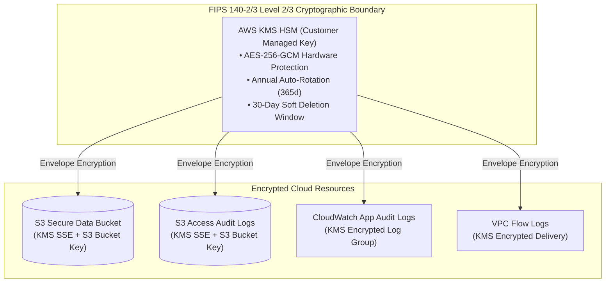
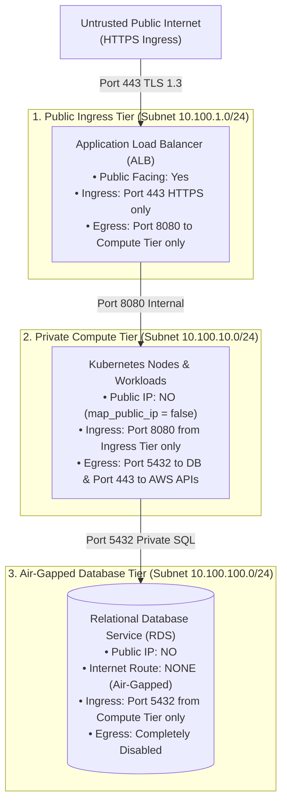

# Architecture & Threat Model Specification

This document details the system design, cryptographic boundaries, network demarcation, and threat modeling of the **Secure AWS & Kubernetes Multi-Standard Compliance Engine**.

---

## 1. Cryptographic Boundary & FIPS 140-2/3 Architecture

The architecture enforces hardware-backed cryptographic protection for all data at rest and in transit.

### Key Technical Decisions:
1. **Customer Managed Key (CMK) vs. AWS Managed Key (`aws/s3`):**
   - AWS-managed default keys (`aws/s3`, `aws/ebs`) do not allow custom Key Policies, cross-account governance, or automated rotation monitoring.
   - Using a Customer Managed Key with `enable_key_rotation = true` satisfies **NIST SP 800-53 SC-12, PCI DSS Requirement 3.5.1, and ISO 27002 Control 8.24**.
2. **S3 Bucket Key Optimization:**
   - Enabling `bucket_key_enabled = true` on S3 buckets allows Amazon S3 to create a bucket-level key, reducing KMS request traffic and associated API costs by up to **99%** while maintaining identical envelope encryption security.
3. **FIPS 140-2/3 HSM Validation:**
   - AWS KMS HSMs are FIPS 140-2/3 validated (Level 2 overall, Level 3 for physical security and cryptographic modules).
   - In-transit communication mandates TLS 1.2+ with approved FIPS ciphers via S3 bucket policies (`aws:SecureTransport = "false"` denial).

---

## 2. Multi-Tier Zero-Trust VPC Network Topology

Network isolation is achieved through physical and routing demarcation across three distinct subnet tiers:

### Routing Controls:
* **Public Route Table:** Associates exclusively with public subnets and points `0.0.0.0/0` to the Internet Gateway (`aws_internet_gateway`).
* **Private Compute Route Table:** Isolated internal routing with optional egress through a NAT Gateway or VPC Endpoints for AWS services.
* **Isolated Database Route Table:** Completely air-gapped. Zero route associations to any Internet Gateway or NAT Gateway.

---

## 3. Kubernetes Zero-Trust Pod Security Architecture

Workloads operate under the **Restricted Pod Security Standard** (the highest level of isolation defined by Kubernetes SIG-Security):

| Control | Setting | Architectural Rationale |
| :--- | :--- | :--- |
| **User Identity** | `runAsNonRoot: true`, `runAsUser: 10001` | Prevents container processes from executing as `root` (UID 0), blocking container breakout attacks. |
| **Filesystem State** | `readOnlyRootFilesystem: true` | Eliminates disk modification attacks (e.g. malware dropping or modifying system libraries in `/usr/bin` or `/etc`). |
| **Kernel Capabilities** | `capabilities: { drop: ["ALL"] }` | Strips all default Linux kernel capabilities (such as `CAP_NET_RAW`, `CAP_SYS_ADMIN`), preventing raw packet crafting and privilege escalation. |
| **Privilege Escalation**| `allowPrivilegeEscalation: false` | Prevents the child process from gaining more privileges than its parent (blocks setuid binaries). |
| **System Call Filtering**| `seccompProfile: { type: "RuntimeDefault" }` | Restricts dangerous system calls at the Linux kernel boundary. |
| **Scratchpad Storage** | In-Memory `emptyDir` (`medium: Memory`, `sizeLimit: 64Mi`) | Allows application scratch memory in RAM (`/tmp`) without touching host storage. |

---

## 4. Threat Modeling Analysis (STRIDE)

| Threat Category | Potential Attack Vector | Applied Mitigation in This Architecture | Verified Standard |
| :--- | :--- | :--- | :--- |
| **Spoofing** | Unauthorized entity attempts to call AWS APIs using stolen credentials. | Enforces IAM Roles for Service Accounts (IRSA) with short-lived OIDC STS tokens; rejects static long-lived keys. | NIST AC-2, SOC 2 CC6.1 |
| **Tampering** | Malicious actor modifies data at rest in S3 or audit logs. | KMS CMK encryption at rest, S3 Object Versioning, and CloudWatch Log Group tamper-resistance with 365-day retention. | PCI DSS 3.4, 10.7 |
| **Repudiation** | Rogue insider executes unauthorized API calls or modifies security groups. | VPC Flow Logs (traffic: ALL) and CIS CloudWatch alarms monitoring `UnauthorizedOperation` and IAM policy mutations. | NIST AU-12, ISO Control 8.16 |
| **Information Disclosure** | Data intercepted in transit over unencrypted connections. | Mandatory S3 bucket policy denying `aws:SecureTransport = false` and ALB TLS 1.2+ ciphers. | NIST SC-8, PCI DSS 4.1 |
| **Denial of Service** | Malicious payload floods container memory or exploits disk exhaustion. | Kubernetes pod memory limits (`256Mi`), CPU limits (`500m`), and in-memory tmpfs cap (`64Mi`). | NIST SC-5, SOC 2 CC6.6 |
| **Elevation of Privilege** | Attacker compromises container and attempts host takeover. | `readOnlyRootFilesystem: true`, `drop: ALL` capabilities, `runAsUser: 10001`, and `allowPrivilegeEscalation: false`. | NIST CM-7, PCI DSS 2.2 |

---

## 5. Automated CI/CD DevSecOps Audit Pipeline

Every commit triggers an automated pipeline enforcing:
1. **Syntax & Provider Compilation:** `terraform validate`
2. **Deterministic Guardrail Assertions:** Python unit test suite verifying KMS rotation, S3 TLS enforcement, and container UID properties.
3. **Static Analysis & Framework Compliance:** Checkov scanning 213 controls across NIST 800-53, ISO 27002, SOC 2, and PCI DSS.
4. **Container & Filesystem CVE Audit:** Trivy scanning container base images and repository dependencies for high/critical vulnerabilities.
