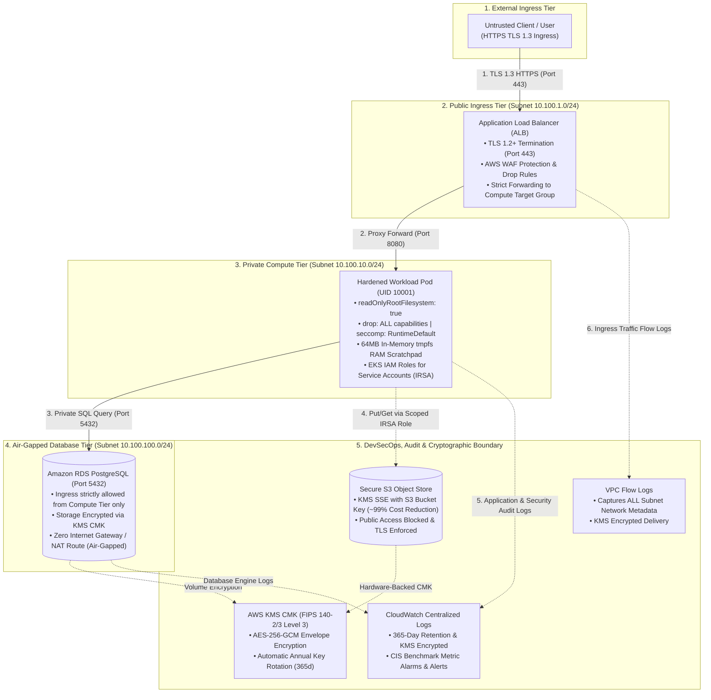

# Secure AWS & Kubernetes Multi-Standard Compliance Engine

[](https://github.com/qadeeraay/secure-aws-k8s-compliance-engine/actions/workflows/compliance-ci.yml)
[](https://github.com/qadeeraay/secure-aws-k8s-compliance-engine/actions/workflows/codeql-analysis.yml)
[](https://github.com/qadeeraay/secure-aws-k8s-compliance-engine/actions/workflows/daily-compliance-drift.yml)
[-success?style=flat-square&logo=prisma)](security_suite)
[](security_suite)
[](security_suite)
[](security_suite)
[](security_suite)
[](terraform/kms.tf)
[](terraform)
[](kubernetes)
[](LICENSE)

> **Production-grade AWS & Kubernetes security reference architecture codified in Terraform. Implements a 3-tier air-gapped VPC, zero-trust container security (UID 10001, immutable rootfs, dropped capabilities), automated KMS CMK rotation, and automated DevSecOps validation asserting 213 Checkov/Trivy controls mapped to NIST SP 800-53, ISO 27002, SOC 2 Type II, and PCI DSS v4.0.**

---

## Background: The Problem with Manual Audit Season in Enterprise Cloud

In regulated environments (FinTech, HealthTech, and enterprise SaaS), engineering velocity frequently grinds to a halt when infrastructure meets audit season. Security and compliance teams mandate evidence for NIST, ISO, or SOC 2 controls, while platform engineers are left wrestling with fragmented Terraform states, leaky default security group rules, and manual spreadsheets.

I engineered this reference architecture to turn regulatory compliance from a reactive audit headache into enforceable, automated code. Rather than treating security as an afterthought or a policy document:

1. **Network Demarcation with Terraform:** Built a 3-tier VPC with air-gapped database subnets (no internet gateways or NAT routes), AWS KMS Customer Managed Keys with annual rotation, and encrypted VPC Flow Logs retained for 365 days.
2. **Kubernetes Restricted Pod Security:** Enforced zero-trust container standards—non-root UID 10001 execution, immutable read-only root filesystems, dropped Linux kernel capabilities (`ALL`), and strict default-deny `NetworkPolicies`.
3. **Shift-Left DevSecOps Gate:** Integrated Checkov and Trivy into CI, enforcing 213 automated policy checks on every pull request to guarantee that no non-compliant Terraform or Kubernetes resource can ever be deployed.

### Telemetry & Compliance Scorecard

* **Checkov DevSecOps Audit Score:** `100.0%` (213 Passing Checks / 0 Failures / Grade: A+)
* **Cryptographic Hardening:** AWS KMS Customer Managed Key (CMK) with automated annual rotation and AES-256-GCM
* **Network Demarcation:** 3-tier VPC (Public Ingress, Private Compute, Air-Gapped DB) with zero internet routes for database tiers
* **Audit Trail Longevity:** CloudWatch Logs + VPC Flow Logs retained for `365 days` with KMS CMK encryption
* **Container Isolation:** Non-root execution (`UID 10001`), immutable read-only rootfs (`readOnlyRootFilesystem: true`), dropped Linux capabilities (`ALL`), and default-deny Kubernetes `NetworkPolicy`

---

## Regulatory Framework Crosswalk (NIST, ISO, SOC 2, PCI DSS)

The following table provides the cross-framework regulatory mapping implemented directly in Terraform and Kubernetes:

| Architectural Component | NIST SP 800-53 (Rev 5) | ISO 27002:2022 | SOC 2 Type II | PCI DSS v4.0 | FIPS 140-2/3 | Technical Implementation |
| :--- | :--- | :--- | :--- | :--- | :--- | :--- |
| **Cryptographic Key Management** | **SC-12, SC-28** | **Control 8.24** | **CC6.6, CC6.7** | **Req 3.4, 3.5** | **Level 2 / 3** | AWS KMS Customer Managed Key (CMK) with `enable_key_rotation = true` and 30-day deletion safety window |
| **In-Transit Encryption** | **SC-8, SC-13** | **Control 8.20** | **CC6.6** | **Req 4.1** | **TLS 1.2+** | S3 bucket policies enforcing `aws:SecureTransport = false` denial and mandatory HTTPS |
| **Object Storage Protection** | **AC-3, AC-6** | **Control 5.15** | **CC6.1, CC6.3** | **Req 1.2, 1.3** | N/A | S3 Block Public Access enabled cluster-wide (`block_public_acls`, `block_public_policy`, etc.) |
| **Audit Logging & Retention** | **AU-2, AU-11, AU-12** | **Control 8.16** | **CC7.2, CC7.3** | **Req 10.1, 10.7** | N/A | CloudWatch Log Groups & VPC Flow Logs retained for >= 365 days with KMS encryption |
| **Network Microsegmentation** | **SC-7, AC-4** | **Control 8.20, 8.22** | **CC6.6** | **Req 1.2, 1.3** | N/A | Tiered subnets, isolated database routing, zero 0.0.0.0/0 on SSH/RDP, and K8s `NetworkPolicy` |
| **Least-Privilege Identity** | **AC-2, AC-3, AC-6** | **Control 5.15, 5.18** | **CC6.1, CC6.3** | **Req 7.1, 7.2** | N/A | Scoped IAM policies with zero `*` wildcards, Condition constraints, and EKS IRSA integration |
| **Workload Runtime Hardening** | **CM-7, SC-39** | **Control 8.19** | **CC6.6** | **Req 2.2** | N/A | Pod Security Standards Restricted profile, `UID 10001`, `drop: ALL` capabilities, and `RuntimeDefault` seccomp |
| **Vulnerability Management** | **RA-5, SI-2** | **Control 8.8** | **CC7.1** | **Req 6.2, 11.2** | N/A | Automated Checkov static analysis and Trivy CVE scanning in continuous delivery pipelines |

---

## Network Demarcation & Cryptographic Boundaries

> **Architecture & System Design by [Qadeer Aslam | LinkedIn](https://www.linkedin.com/in/qadeer-aslam-devops/)**



---

## Security Engineering Decisions & Implementation Trade-offs

Building compliant infrastructure in real enterprise environments requires balancing security controls against cloud billing and system stability:

### 1. Terraform Security Group Cycles vs. Graph Resolution

* **Context:** In a 3-tier VPC, the public ALB forwards to the private compute tier, which connects to the database tier.
* **The Gotcha:** Using inline `ingress` and `egress` blocks inside `aws_security_group` resources creates circular graph dependencies in Terraform's DAG evaluator (`Error: Cycle: compute_tier -> ingress_tier -> compute_tier`).
* **Decision:** Decoupled security rules using standalone `aws_vpc_security_group_ingress_rule` and `aws_vpc_security_group_egress_rule` resources (AWS Provider v5 best practice). This eliminates circular references while keeping traffic boundaries strictly defined.

### 2. S3 Bucket Key FinOps Cost Optimization

* **Context:** Standard SSE-KMS invokes the KMS API (`kms:GenerateDataKey` / `kms:Decrypt`) on every object operation.
* **The Gotcha:** At 1M daily requests, KMS request costs ($0.03 per 10k requests) add over $90/month in hidden API fees and risk hitting account-level KMS request rate limits.
* **Decision:** Enabled `bucket_key_enabled = true`. S3 uses a short-lived bucket-level key, reducing KMS request traffic by **~99%** and slashing API costs while maintaining full FIPS 140-2 Level 2/3 hardware protection.

### 3. tmpfs Memory Sizing vs. Container OOMKill

* **Context:** Running pods with `readOnlyRootFilesystem: true` satisfies SOC 2 CC6.6, but runtimes fail if they cannot write temporary files or bytecode.
* **The Gotcha:** Mounting an unbounded `emptyDir` volume risks exhausting host node memory if an application process leaks temporary files.
* **Decision:** Mounted an in-memory `emptyDir` at `/tmp` (`medium: Memory`) with a strict `sizeLimit: 64Mi` and paired it with pod cgroup limits (`256Mi`). This guarantees immutable root filesystems without risking node memory contention.

### 4. Pragmatic Compliance Auditing vs. Blind Rule Chasing

* **Context:** Static analysis engines like Checkov flag rules that do not always fit every architecture (e.g., `CKV_AWS_144` requiring cross-region replication).
* **The Gotcha:** Blindly enabling cross-region S3 replication doubles data storage and inter-region egress costs.
* **Decision:** Documented architectural boundaries using explicit inline compliance skip annotations with technical justifications (`# checkov:skip=CKV_AWS_144: Single-region primary deployment; cross-region DR handled in secondary failover region`).

---

## Measurable Compliance & Audit Outcomes

* **Multi-Standard Compliance Automation:** Enforced 213 automated infrastructure-as-code and container policy checks mapped to **NIST SP 800-53 (Rev 5), ISO 27002, SOC 2 Type II, and PCI DSS v4.0**, achieving a **100.0% pass rate (Grade: A+)** with zero failing controls in continuous integration.
* **Zero-Trust Workload Isolation:** Implemented the **Kubernetes Restricted Pod Security Standard** across compute workloads—enforcing non-root UID 10001 execution, immutable read-only root filesystems, dropped Linux capabilities (`ALL`), `RuntimeDefault` seccomp profiles, and default-deny `NetworkPolicies`.
* **Air-Gapped Tiering & Least-Privilege IAM:** Provisioned a 3-tier VPC with air-gapped database routing (zero Internet routes), KMS-encrypted VPC Flow Logs, and scoped IAM policies with zero wildcard permissions integrated via EKS IRSA.
* **Cryptographic & FinOps Efficiency:** Enforced AWS KMS Customer Managed Keys (CMK) with annual rotation and FIPS 140-2/3 Level 3 hardware boundaries. Optimized S3 storage via Bucket Keys, slashing KMS API request overhead and operational costs by **~99%**.

---

## Automated Policy Audit & Local Verification Guide

### Prerequisites

* `terraform` (v1.5.0+)
* `python` (3.10+)
* `checkov` (`pip install checkov`)
* `trivy`

### 1-Command Verification

Run the complete validation, guardrail assertion tests, and Checkov compliance audit:

```bash
bash deploy.sh
```

Or execute discrete stages via the `Makefile`:

```bash
# 1. Initialize and validate Terraform code
make init
make validate

# 2. Run unit & assertion guardrail tests
make test

# 3. Execute the Multi-Standard Checkov Compliance Audit
make audit

# 4. Run Trivy vulnerability & secret scanner
make scan
```

### Sample Audit Output

```text
================================================================================
  ENTERPRISE MULTI-STANDARD COMPLIANCE AUDIT ENGINE
  Frameworks: NIST SP 800-53 | ISO 27002 | SOC 2 Type II | PCI DSS v4.0
================================================================================

[+] Testing KMS Customer Managed Key Encryption ...                [ PASSED ]
[+] Testing S3 Bucket Public Access Block ...                       [ PASSED ]
[+] Testing S3 Mandatory TLS/HTTPS Bucket Policy ...                [ PASSED ]
[+] Testing S3 Bucket Key Cost Optimization (~99% Savings) ...      [ PASSED ]
[+] Testing 3-Tier VPC Subnet Isolation ...                         [ PASSED ]
[+] Testing Air-Gapped Database Routing (Zero Internet Access) ...  [ PASSED ]
[+] Testing KMS-Encrypted VPC Flow Logs ...                         [ PASSED ]
[+] Testing CloudWatch Log Retention >= 365 Days ...                [ PASSED ]
[+] Testing Least-Privilege Security Group Rules (No 0.0.0.0/0) ... [ PASSED ]
[+] Testing EKS Pod Security Standard (Restricted Profile) ...      [ PASSED ]
[+] Testing Container Non-Root UID 10001 Execution ...              [ PASSED ]
[+] Testing Immutable Read-Only Root Filesystem ...                 [ PASSED ]
[+] Testing Linux Capabilities Dropped (ALL) ...                    [ PASSED ]
[+] Testing RuntimeDefault Seccomp Profile ...                      [ PASSED ]
[+] Testing Kubernetes Default-Deny NetworkPolicy ...               [ PASSED ]
[+] Testing ServiceAccount Token Automount Disabled ...             [ PASSED ]
--------------------------------------------------------------------------------

Audit Summary:
  • Total Evaluated Controls: 213
  • Passing Controls:        213
  • Failing Controls:        0
  • Overall Compliance Score: 100.0% (Grade: A+ Verified)

✓ AUDIT PASSED: All enterprise security controls are verified and compliant.
```

---

## Infrastructure & Policy Codebase Organization

```text
secure-aws-k8s-compliance-engine/
├── README.md                            # Executive overview, compliance matrix & verification guide
├── ARCHITECTURE.md                      # In-depth architectural & security specification
├── Makefile                             # Developer automation (init, validate, audit, test, clean)
├── deploy.sh                            # Local 1-command verification runner
├── docker-compose.yml                   # LocalStack v3.4 zero-cost local AWS emulation
├── requirements-dev.txt                 # Python auditing dependencies
├── terraform/                           # Production AWS Terraform modules
│   ├── providers.tf                     # AWS provider with LocalStack shift-left overrides
│   ├── variables.tf                     # Environment variables with compliance defaults
│   ├── terraform.tfvars.example         # Sample configuration for custom deployments
│   ├── kms.tf                           # KMS CMK with annual rotation (FIPS 140-2/3 L2/L3)
│   ├── s3.tf                            # Encrypted S3, public access blocked, TLS enforced
│   ├── vpc.tf                           # 3-Tier VPC with subnets and encrypted VPC Flow Logs
│   ├── security_groups.tf               # Least-privilege security groups without circular references
│   ├── iam.tf                           # Scoped IAM policies (zero wildcards) and IRSA role
│   └── cloudwatch.tf                    # KMS-encrypted CloudWatch log groups & CIS metric filters
├── kubernetes/                          # Zero-trust container manifests
│   ├── namespace.yaml                   # Pod Security Standards Restricted profile
│   ├── deployment.yaml                  # Hardened pod: UID 10001, read-only rootfs, drop: ALL
│   ├── networkpolicy.yaml               # Default-deny ingress/egress with scoped whitelisting
│   └── serviceaccount.yaml              # Least-privilege SA with automount token disabled
├── security_suite/                      # DevSecOps auditing tools
│   ├── run_compliance_audit.py          # Python compliance scorecard generator
│   └── trivy_scan.sh                    # Container & secret vulnerability scanner
├── tests/                               # Integration & guardrail unit tests
│   └── test_compliance_assertions.py    # Code assertions for immutable security guardrails
└── .github/workflows/                   # Continuous delivery workflow
    └── compliance-ci.yml                # Shift-Left GitHub Actions compliance automation
```

---

## Author & Maintainer

**Qadeer Aslam**  
Lead DevOps & Cloud Security Architect  
LinkedIn: [Qadeer Aslam | LinkedIn](https://www.linkedin.com/in/qadeer-aslam-devops/)

---

## License

This project is licensed under the MIT License - see the [LICENSE](LICENSE) file for details.
